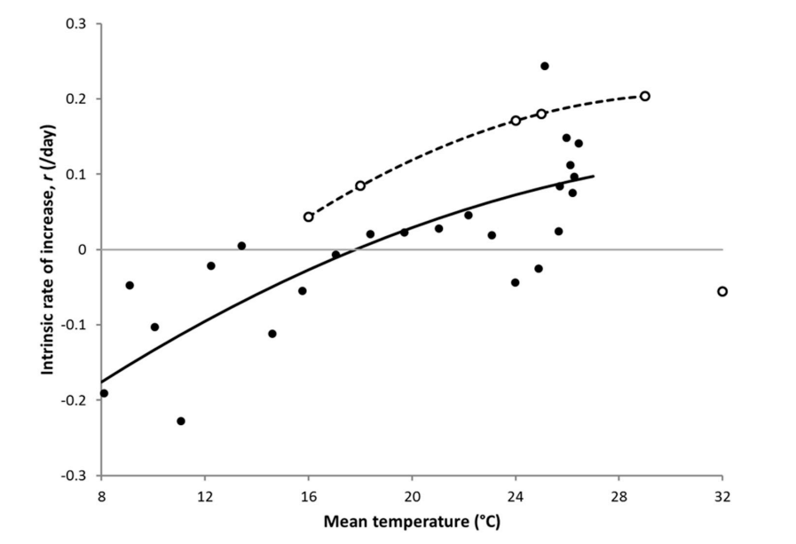
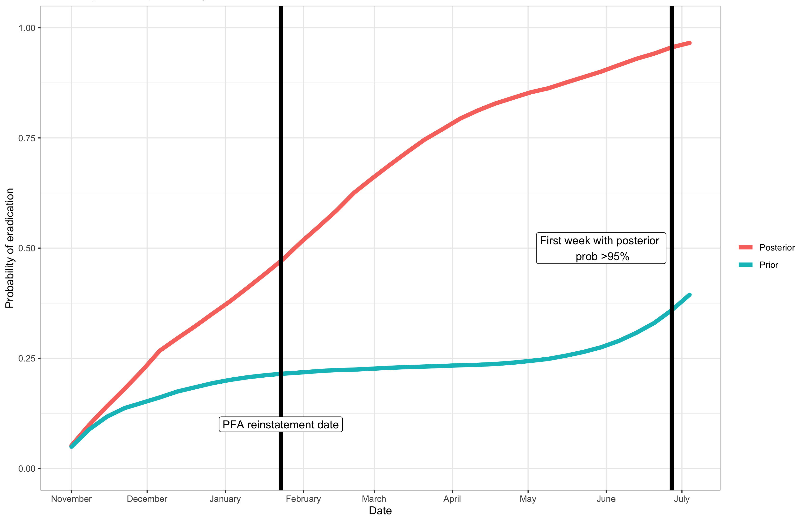

```{r echo=F, include=F}
library(ggplot2)
library(ggforce)
theme_set(theme_bw())
```


# Case study: Mediterranean fruit fly

## Introduction

In the previous chapter, I proposed a model for evaluating and proposing zero-catch criteria in specific situations, for various locations, seasons, and species of fruit fly. In this chapter, I illustrate the method by applying the model to a hypothetical outbreak. Mediterranean fruit fly is chosen for its economic significance, and Adelaide is chosen because of the availability of research on trapping sensitivity performed there. The analysis is primarily illustrative. As before, modelling is performed with a view to evaluating existing zero-catch criteria, and toward developing new criteria. The headline result of the model is that, under the model, using the existing zero-catch criteria leads to a high risk of declaring eradication "too early", i.e. while the presence or absence of flies is still highly uncertain.

## Medfly (Ceratitis capitata)

Mediterranean fruit fly (*Ceratitis Capitata*) or *Medfly* are a particularly salient species of tephritid fruit fly. Medfly has high invasive potential, as it can adapt to a relatively large range of climates and environments, and is known to have the capability to infest the fruits of over 300 species of plants (@sciarretta2018). Recently, an incursion of Medfly in Adelaide, South Australia, prompted a large scale eradication effort. This comprised in part of hiring 350 special-purpose staff that set over 13,000 additional traps and collected over 350 tonnes of fruit. The scale of the response to this outbreak indicates the perceived economic significance of this species. 

Medfly are very hard to detect at low levels. As with other fruit fly species, monitoring is typically performed with the aid of traps fitted with chemical attractants. These traps are relatively ineffective. For example, one study from the Adelaide metro area trapping grid found that only 0.02% of flies were recaptured from a release of 38.8 million sterilised flies. If this is an accurate reflection of trap sensitivity, then very large populations may be undetectable for significant periods of time. Further, Medfly are known to disperse only small distances (@ms2007). This means that, if they are in a location that is not heavily monitored, they may evade detection for long periods. 

## Data

As mentioned above, I do not use real data to estimate parameters. Instead, I model a hypothetical situation. The situation is intended to simulate the conditions described in codes of practice for use of zero-catch criteria (see @supptraps). The general situation is as follows: We assume that at least one fly has been detected; eradication measures have since begun and then ceased; and we now proceed with intensified monitoring, while whatever population that may exist is free to grow relatively unhindered. The goal of the analysis is to infer the probability of eradication for the incipient population, given that no flies are detected at any point in this period. 

It is preferable to specify a location, so that real weather data can be used to inform the model's hyperparameters (see \@ref(popn-size)). Therefore, it is assumed that the outbreak takes place in Adelaide. Adelaide is a key location for fruit fly outbreaks. Further, for Medfly, evidence from trap sensitivity studies is available from experiments performed in Adelaide, but no other Australian city.

The zero-catch criterion is 12 weeks, or 28 days and one generation, whichever is longer (@meats2005). In a typical Australian summer, a Medfly generation takes 28-34 days (@dpirdwa). Therefore, the period I look at is over 12 weeks.^[See also @pirsa, who state that the suspension period is 12 weeks in an Adelaide summer.] I.e., in the terminology of chapter \@ref(ch3), we set $T = 12$. To evaluate this criteria, we want to find the probability of eradication after $T=12$ weeks, i.e. $\Pr(N_{12} = 0 \mid \mathbf y = \mathbf 0_{12})$.

It is assumed that general surveillance traps are spaced in a $400 \times 400$ metre grid, year-round. We assume that a fly is caught at the centre of the grid (without loss of generality). Then, 16 *supplementary* traps are placed within a 200-metre radius of the location of the first detection (see figure \@ref(fig:trapgrid)). These traps are checked weekly for 6 weeks ($t \in \{1, \ldots, 6\}$) before being removed. Following this, we continue to monitor with only the original general surveillance traps. It is assumed that no fly is caught at any point in this period. Pest free area status is reinstated after 12 weeks. After this, we continue to observe no fruit flies indefinitely.

As mentioned previously, it is assumed that trap locations have fixed, known locations. In particular, we assume that monitoring is intensified for the first 6 weeks ($t \in \{1, \ldots, 6\}$). By intensified monitoring, I mean that **supplementary** monitoring traps have been placed alongside the previously existing grid of **general** monitoring traps. More precisely, it is assumed that **general** surveillance traps are placed year-round in a 400 $\times$ 400 metre grid (DPIPWE, 2011, p. 50). The **supplementary** surveillance system consists of a set of 16 traps in a circular area, centred at the site of the first fly detection.^[It is typical to wait until at least 2 flies have been detected near each other for an outbreak to be declared. To illustrate the method in a simplified setting, I suppose that one fly detection is sufficient.] See figure \@(fig:trapgrid).

It is assumed that the outbreak starts on November 1, 2020. The year 2020 is chosen rather than 2021, so that weather data is available for at least 1 year from the start of the monitoring period. (The time of writing is May 2022.) Data on historical daily temperature averages (the mean for each day) were obtained from the Bureau of Meteorology.

```{r trapgrid, echo=F, fig.cap = 'Illustration of the hypothetical trapping grid. Grey circle represents 200m radius disc surrounding the site of the most recently detected Medfly specimen.'}

grid_size = 4
general_grid_1d = seq(-grid_size / 2, grid_size / 2) * 400
general_grid = expand.grid(general_grid_1d, general_grid_1d)
general_traps = as.matrix(general_grid)

d = 200 / sqrt(2)
supp_grid_1d = seq(-d, d, length.out = 4)
supp_traps = expand.grid(supp_grid_1d, supp_grid_1d)
all_traps = rbind(general_traps, supp_traps)

supp_indicator = rep(c('General', 'Supplementary'), c(nrow(general_traps), nrow(supp_traps)))
traps_df = data.frame(all_traps, factor(supp_indicator, c('Yes', 'No')))

# Plot of traps
ggplot(traps_df) +
  geom_circle(aes(x0=0, y0=0, r=200), colour = 'grey') +
  geom_point(aes(Var1, Var2, col=supp_indicator)) +
  coord_fixed() +
  xlab('X coordinate (metres)') +
  ylab('Y coordinate (metres)') +
  labs(col = 'Trap type') +
  scale_x_continuous(breaks = (-4:4)*200) +
  scale_y_continuous(breaks = (-4:4)*200) 
```

## Model

I now propose a model for the case discussed above. This discussion builds on \@ref(ch3), where I outlined the model in broad generality. There, I discussed the model while leaving some key situation-specific hyperparameters and distributions unspecified. For example, the prior distribution on the initial population size $N_1$, and the relationship between probability of capture given distance between fly and trap $p(c \mid d)$ were unspecified.^[In that chapter, distance was denoted as $d_{i,t,k}$, to stress that distance was measured between a given fly $i$ and a given trap $k$ in a given week $t$. Here, I denote distance $d$, under the assumption that distance is still understood to be between a fly and a trap.] Here, these gaps are filled. Hyperparameters and distributions are proposed and justified.

As in the previous chapter, the model is broken into prior distributions and likelihood in the following way. Firstly, (1) The size of the population (number of individuals); (2) the locations of individuals and traps; and (3) the number of individuals caught in traps, conditional on (1) and (2). To structure the discussion, I discuss these elements in turn, beginning with prior distributions.

Here, we are modelling the risk of an adverse event (namely an undetected pest invasion). In such cases, we might consider examining a worst-case scenario. In this case, this could be done by specifying prior distributions such that we assign high density to cases where (a) the growth rate is very close to zero, so that the fly population is capable of persisting at below-detectable levels indefinitely, or (b) flies are located far away from surveillance traps. Given these considerations, it should be trivial to identify worst-case scenarios where we can almost never be certain that flies are eradicated, given any length of time. However, such results are likely unreasonable, and do not accurately reflect our prior state of information. Nonetheless, I attempt to err on the side of pessimism about the ease at which fly populations can be detected, while nonetheless making the prior distribution as realistic as possible, given constraints on what is known about them.

### Prior distributions

#### Population size $N_t$ {#popn-size}

In this case, $N_1$ is the first week after the most recent fly detection. I have chosen to set $N_1 \sim \operatorname{Geometric}(1/20)$. This is chosen as it is a discrete distribution with right skew, and a relatively large amount of mass in the region of $x = 0$, corresponding to the situation where flies are already eradicated (see figure \@ref(fig:priorinitsize)).^[The geometric distribution is also a natural choice for this latent variable; I do not explore this further here.] The mean of the geometric distribution is chosen arbitrarily. The primary goal is to have a small population on average, with non-zero risk of a population size greater than 50. However, it is not clear, without prior domain knowledge, whether this distribution is empirically reasonable. Population counts do not exist for past outbreaks. This issue is discussed further in section \@ref(discussion).

```{r priorinitsize, echo=F, fig.cap = 'Prior distribution of initial population size $N_1$.'}
g = 1/20
init_pmf = function(n, g) g / (1+g)^(n+1)

x = 0:150

df = data.frame(x = x, y = dgeom(x, 1/20))

ggplot(df) +
  geom_bar(stat = 'identity', aes(x, y), na.rm=T) +
  xlab(bquote(italic(n))) +
  ylab(bquote('Pr('*italic(N)[1] == italic(n)*')')) +
  coord_cartesian(xlim=c(0, 100)) +
  theme_bw()

# Prior probability that they're already eradicated
```

As for $N_t$, for $t \in \{2, \ldots, T\}$, I assume the Poisson branching process with exponential growth, discussed in \@ref(ch3). To recap, it is assumed that, for $t \in \{2, \ldots, T\}$,  $N_t \mid \{ N_{t-1}, R_t \} \sim \mathrm{Poisson}(N_{t-1} e^{R_t})$. 

It is assumed, primarily for convenience, that $R_t \sim \mathrm N(\mu_t, \sigma^2_t)$. Choices for the hyperparameters $\{\mu_t\}_{t=2}^T$ are informed by the results of @ks2019. The authors transform observed captures $C_t$ as $\ln (C_t / C_{t-1})$, and fit a simple model to the resulting values from field data on Medfly captures.^[Notably, temporal autocorrelation is ignored.] In particular, they estimate the mean *daily* growth rate, conditional on mean daily temperature, for each day $t$, to be
$$
\mathrm E(R_t \mid \mathrm{Temp}_t) = \alpha \mathrm{Temp}_t^2 + \beta \mathrm{Temp}_t + \gamma,
$$
where $\alpha = -0.000386$, $\beta = 0.0279$, and $\gamma = -0.374$. To get the daily mean growth rates, observed daily temperatures are plugged into this formula. Then, weekly mean growth rates $\mu_t$, are derived by summing over daily growth rates within each week. The dataset used by @ks2019 is small, consisting of only 24 observations. Ideally, we would quantify uncertainty about these estimates. However, this is difficult, as the authors do not provide data or an analysis of the variance of residuals for their model. I do not explore this further here, though it should be considered in real applications.

The choice for $\sigma^2_t$ is necessarily more arbitrary than the choice for $\mu_t$. As mentioned above, @ks2019 do not provide an analysis of the variance of residuals for their model. Therefore, it is difficult to meaningfully quantify prior beliefs about the variance of the growth rate. Increasing the variance increases the prior probability that populations die out, due to runs of "bad luck". Therefore, smaller variances are more pessimistic. With this in mind, I have chosen to set the standard deviation for daily growth to $\sigma_t = \sigma = 0.1$. In my view, this is roughly consistent with the plot provided by the authors (see figure \@ref(fig:ksplot)). However, as this choice is arbitrary, it should be treated with scepticism.

(ref:caption) Relationship between population increase $\ln (C_t / C_{t-1})$ and mean daily temperature. Taken from @ks2019. The solid line is fit to field data (black points); the dashed line is fit to lab data (white points).

```{r ksplot, echo=F, out.width='75%', fig.align = 'center', fig.cap = '(ref:caption)'}

```

#### Spatial location

As mentioned in the previous chapter, the model is spatial. This is because the likelihood of detection depends on distances between traps and individual flies. As in the previous chapter, prior distributions must be set for the location of the population centre, and for dispersals of individual flies from that centre.

##### Population location

The centre of the population is assumed to be located at the two-dimensional vector $L_c$. I have set the prior on $L_c$ to be 
$$
L_c \sim \mathrm {Normal}_2 (\mathbf 0_2, 160^2 I_2),
$$
where $\mathrm{Normal}_2$ is the bivariate normal distribution, $\mathbf 0_2$ is the two-dimensional zero vector and $I_2$ is the $2 \times 2$ identity matrix. This prior reflects a prior belief that the centre of the population is highly likely to be close to the centre of the grid, where a fly was detected most recently (we suppose). E.g., we believe that there is a 95% chance that the centre of the population is within $1.96 \cdot 160 \approx 320$ metres of the centre of the grid.^[For details about how this prior was arrived at, see appendix.] This makes sense, as the setting of supplementary traps close to the centre, as is standard, belies a prior belief that other flies are likely to be located in the vicinity of the first capture.

##### Individual fly dispersals

Let $L_{i, t}$ denote the location of fly $i$ at time $t$, as in the previous chapter. I assign this quantity the prior distribution $$L_{i, t} \mid L_c \sim \mathrm {Normal}_2 (L_c, 12.5^2 I_2),$$ where the notation is defined as in the previous section above. The variance is chosen so that ~95% of flies are within 30 metres of the population centre. Here, 30 metres is chosen arbitrarily. It reflects a belief that flies typically do not disperse very far. This is a pessimistic ("worst-case") assumption. When flies are spread further from their population centre, it is more likely that at least one is close to a trap. As such, large populations of flies are less likely to go undetected.

The normal distribution is chosen for a few reasons. Firstly, it is conceptually simple and intuitive to parameterise. This helps with expert elicitation. Secondly, the location has a simple marginal distribution, thanks to the fact that a normally distributed random variable with a normally distributed mean is itself normal.^[This is just the standard conjugacy of the multivariate normal mean for the multivariate normal likelihood when the covariance matrix is fixed.] Thirdly, the distance between a normal random variable and its mean has a known distribution. In particular, if $X \sim \mathrm{Normal}_2(\pmb \mu, \sigma^2 I_2)$, then $\lVert X - \pmb \mu \rVert^2 \sim \Gamma(1, \sigma^2/2)$, where $\Gamma(a, b)$ is the gamma distribution with shape $a$ and scale $b$. In this case, or any fly $i$ we have $\lVert L_{i,t} - L_c \rVert \mid L_c \sim \Gamma(1, 12.5^2/2)$. Similarly, the *marginal* squared distance between fly $i$ and the origin is $\lVert L_{i, t} \rVert^2 \sim \Gamma(1, (12.5^2 + 160^2) / 2)$. Knowing this allows us to easily compare and calibrate the distribution against experimental results. This, in turn, makes elicitation of prior distributions simpler and more intuitive. (It allows us to visualise, for example, the distribution of distances to the origin, as well as to the population centre.)

There is evidence suggesting that Medfly dispersal distance is in fact distributed as a power law (see, e.g., @meats2005 and @plant1991). In particular, the distributions estimated by these authors have far heavier tails than the distribution proposed above. As mentioned above, the normal prior implies that squared dispersal distances are gamma random variables, the square roots of which are Nakagami distributed. The Nakagami distribution, parameterised as above, has a far thinner right tail than a power law. As such, the present prior distributions may heavily underestimate our best guess about the dispersal distances of individual flies. In further work, we might investigate whether this has a large effect on the results through sensitivity analysis (see section \@ref(discussion)).

It may also be worth noting that, in real cases, the assumption of zero mean and spherical covariance matrix ($\sigma^2 I_2$) may not be reasonable. Dispersals may have non-zero mean (due to wind direction) and the distance and/or direction of individual dispersals may be correlated.^[These claims are argued for Medfly by @baker1986.] Further, it may not be reasonable to assume, as I have done here, that the fly population cannot move across time. Ideally, the importance of these assumptions should be checked based on the case at hand (e.g. properties of the situation or species in question). Extending the model in various ways to meet these problems is beyond the scope of this work, but warrants further investigation.

### Likelihood

The likelihood is the distribution of $y_t \mid \{N_t, \mathbf L_t\}$. This is specified as in the previous chapter. All that we need to specify here is the probability of capture as a function of distance. This function tells us how probable it is that fly $i$ is captured in trap $k$ at time $t$ conditional on $\lVert L_{i, t} - L_k \rVert$, where, $L_{i, t}$ is the location of fly $i$ at time $t$, and $L_k$ is the location of trap $k$. Because the trap locations are fixed and known, the $N_t \times K$ pair-wise distances between flies and traps are known, conditional on $\{N_t, \mathbf L_t\}$.

Here, the likelihood is structured as in chapter 3. The only part of the model unspecified there is the probability of capture given distance between fly and trap. I write this as $p(c \mid d)$, where $c$ is the event that a fly is captured, and $d$ is the distance between fly and trap. Since the trap locations are fixed and known (we assume), then, conditional on the locations of flies, $p(c \mid d)$ tells the probability that the fly is captured in any trap $k$ as a function of distance $d = \lVert L_{i} - L_k \rVert$, where $L_i$ is the location of the fly, and $L_k$ is the location of the trap.

As mentioned previously, results of trap sensitivity studies are used to inform the likelihood of capture. In particular, I use the results of @meats2005. These authors estimate that the probability of capture for any given fly in any given trap is given by the power law
$$
p(c \mid d) = \begin{cases}ad^{-b}, & d>1 \\ a & 0 \geq d \geq 1.\end{cases}
$$
Here, $a = 0.2351055$, $b = 1.37$, and $d$ is the distance between the fly and the trap at the start of the period.^[Note that these are transformed from the values reported by the authors. The function is (a) transformed from percentage to proportion scale, (b) halved, as the traps only capture *male* flies, which consist of approximately half of the population, and (c) converted from kilometre to metre scale.] Thresholding is introduced because (a) the function does not yield valid probabilities for small enough $d$. This function is used for convenience as it is provided by the authors of the study, and data is not publicly accessible. In the context of a more detailed analysis, it may be beneficial to consider uncertainty in the probability of capture by specifying hyperprior distributions for $a$ and $b$. I do not explore this further here, as the model is intended to be illustrative only.

Finally, an adjustment is made to $p(c \mid d)$, before the formulae from the previous chapter are used. In $p(c \mid d)$ we have the probability of capture over the lifetime of the individual. However, for any given week, we wish to know the probability of reporting capturing a fly over that week. It is assumed that the lifetime is roughly 4 weeks. The correction is reported in detail in the appendix.

### Full statement of the model

The model is summarised in the following table.

$$
\renewcommand{\baselinestretch}{1}\normalsize
\begin{aligned}
&\textbf{Population size prior} \\
&\text{Initial no. of flies:} && N_1  \sim \mathrm{Geometric}(1/20) \\
& \text{Number of flies:}~ && N_t \mid N_{t-1}  \sim \mathrm{Poisson}\{ N_{t-1} \exp(R_t) \} \text{, where} \\ & && R_t \sim \mathrm{Normal}(\mu_t, 0.07^2), & t \in \{2, \ldots, T \} \\
\\
&\textbf{Location prior} \\
& \text{Population location:} ~ && L_c \sim \mathrm{Normal_2}(\mathbf 0_2, 160^2 I_2) \\
& \text{Fly locations:}~ && L_{i,t} \mid L_c \sim \mathrm{Normal}_2(L_c, 12.5^2 I_2) & i \in \{1, \ldots, N_t\}, \\
  &&&& t \in \{1, \ldots, T\}\\
\\
&\textbf{Likelihood} \\
& \text{Number of traps:}~ && K \in \mathbb N_+ \\
& \text{Trap locations:}~ && L_k^\text{trap} \in \mathbb R & k \in \{1, \ldots, K\} \\
& \text{Dist. btw. fly } i \text{ and trap } k \text{ at time } t \text{:} && \delta_{i,k,t} := \lVert L_k^\text{trap} - L_{i,t} \rVert & i \in \{1, \ldots, N_t\}, \\
  &&&& k \in \{1, \ldots, K\}, \\
  &&&& t \in \{1, \ldots, T\}\\
& \text{Prob. fly } i \text{ captured in trap }k \text{ at } t: && p(c \mid \delta_{i,k,t}) = \begin{cases}0.235 \cdot \delta_{i,k,t}^{-1.37}, & \delta_{i,k,t} > 1 \\ 0.235 & \delta_{i,k,t} \in [0,1],\end{cases} & i \in \{1, \ldots, N_t\}, \\
  &&&& k \in \{1, \ldots, K\}, \\
  &&&& t \in \{1, \ldots, T\}\\
& \text{Individ. cap. prob.:} && p_{i, t} = 1 - \prod_{k=1}^K (1 - p(c \mid \delta_{i,k,t})), & i \in \{1, \ldots, N_t\}, \\
  &&&& t \in \{1, \ldots, T\} \\
& \text{Aggregate cap. prob.:} && p_t = 1 - \prod_{i=1}^{N_t} (1 - p_{i,t}) & t \in \{1, \ldots, T\} \\
&\text{Detection:}~ && y_t \mid \{ \mathbf L_t, N_t \} \sim \operatorname{Bernoulli}(p_t), & t \in \{1, \ldots, T\} \\
  &&& \mathbf y := [y_t]_{t=1}^T \\ \\
&\textbf{Posterior distribution of interest} \\
&\text{Population size given no detection:} && N_t \mid \mathbf y = \mathbf 0_t & t \in \{1, \ldots, T\}
\end{aligned}
\renewcommand{\baselinestretch}{1}\normalsize
$$

## Sampling

Inference is performed by sampling from the posterior distribution. Recall that the goal of the model is to (a) evaluate, and (b) propose, zero-catch criteria for Medfly. These are minimum lengths of time over which no flies are detected, before which we can infer and declare eradication. With respect to (a), the key quantity of interest is $\Pr(N_t = 0 \mid \mathbf y = \mathbf 0_t)$, where $t$ is the existing zero-catch criteria. In plain English, this is the probability that flies are eradicated, given that they haven't been detected after $t$ weeks of monitoring. With respect to (b), the key quantity of interest is the smallest $t$ such that $\Pr(N_t = 0 \mid \mathbf y = \mathbf 0_t) > 1 - \alpha$, where $\alpha \in [0, 1]$ represents the decision-maker's degree of risk tolerance.

As such, we need a sampling algorithm that can give us draws of $N_t \mid \mathbf y = \mathbf 0_t$, for any cutoff $t$. Note that this is distinct from the distribution of $N_t \mid \mathbf y = \mathbf 0_T$, where $t<T$. At time $t$, we do not know that we will not get another detection up to time $T$. Rather, we only know that we have not detected any flies yet **up to now** (i.e. time $t$). Therefore, conditioning on the event $\mathbf y = \mathbf 0_T$ means that we condition on information not yet available to us. Note, however, that the event where $\mathbf y = \mathbf 0 _T$ is a **subset** of the event where $\mathbf y = \mathbf 0_t$. Observing no detections to time $T$ logically implies that we did not observe any detections to time $t$ (assuming $t < T$). But the converse is false. 

There is a key difficulty with sampling with such methods for this case. This model is *agent-based*, insofar as the individual properties of a random number of individuals (agents) are explicitly represented. In this case, at any time $t$, there is a location $L_{i,t}$ for each of $N_t$ flies. Since $N_t$ is itself unknown, this means that the number of parameters (namely the number of $L_{i, t}$ terms) is unknown.^[This is a situation in which "the number of things you do not know is one of the things you do not know" (@richardson1997bayesian).] As mentioned in chapter 2, this introduces a difficulty, as standard Markov chain Monte Carlo techniques, such as basic Metropolis-Hastings, fail when this is the case.

To get around this problem, I have used a simple extension of the basic ABC rejection sampler (see chapter 2). This sampler gives exact, independent, pseudorandom draws from the distribution of $N_t \mid \mathbf y =  \mathbf 0_t$, for any $t \in \mathbb N_+$. This sampler is intuitive, simple to implement, and relatively efficient for this problem (for the case discussed here, roughly 25% of samples are *not* rejected). However, other methods exist that may be worth exploring, for analogous problems where the rejection rate of ABC is higher.^[The best known "trans-dimensional" Markov sampler is the reversible jump MCMC of @green1995, generalised by @keith2004.] 

### Sketch of the algorithm

Here I present an algorithm for drawing *at least* $S$ independent samples from the distribution of $N_t \mid \mathbf y = \mathbf 0_t$, for all $t$ up to some arbitrary cutoff $T$. Note that this quantity is distinct from $N_t \mid \mathbf y = \mathbf 0_T$. At time $t$, we do not know that we will not get another detection up to time $T$. We only know that we have not detected any flies yet **up to now** (i.e. time $t$).

* Set a number of time periods (i.e. weeks) $T$ that is arbitrarily large, so that it covers all time points of interest.
* For each sample $j$:
  * Draw the number of flies and their locations for all time points from their prior distributions.
  * Draw an indicator variable determining whether a fly is captured for each time point $\mathbf y = \{y_t\}_{t=1}^T$.
  * Store the first (smallest) $t$ such that $y_t = 1$. Call this quantity $\tau_j$. If $\mathbf y = \mathbf 0_T$, set $\tau_j = \infty$.
* Stop when the number of samples with $\tau_j = \infty$ is $S$.
  
For any number of weeks $t$, we then extract the subset of draws such that $\tau_j > t$. This subset is a set of independent posterior draws from $N_t \mid \mathbf y = \mathbf 0_t$. Depending on how often we observe $\tau_j = \infty$, we may end up with a much larger number of samples than $S$. But we end up with exactly $S$ samples such that $\tau_j > \infty$, and therefore $S$ draws of $N_T \mid \{y_t\}_{t=1}^T = \mathbf 0_T$, where $T$ is the final time point we consider.

Why does this algorithm work? It may help to consider the simple ABC rejection sampler for $N_T \mid \mathbf y = \mathbf 0_T$, for some $T \in \mathbb N_+$. This algorithm works by (1) drawing $\Theta = \{N_i, \mathbf L_t\}_{t=1}^T$ from the joint prior distribution; then (2) drawing a vector $\mathbf y = [y_t]_{t=1}^T$ conditional on $\Theta$; then (3) rejecting the sample if $\mathbf y \neq \mathbf 0_T$, and keeping it if $\mathbf y = \mathbf 0_T$. Here, we are getting independent draws from $p(\Theta \mid \mathbf y = \mathbf 0_T)$ by taking draws from $p(\Theta, \mathbf y)$, and extracting the subset of draws for which $\mathbf y = \mathbf 0_T$. 

Now note that $y = \mathbf 0_t$ if and only if the first detection of a fly occurs after time $t$. In other words, these are the same event. Denote $\tau$ as the time of the first detection. Then, the event that the first detection is after $t$ is $\{\tau > t\}$. It follows trivially that
$$
\Pr(N_t = n \mid \mathbf y = \mathbf 0_t) = \Pr(N_t = n \mid \mathbf \tau > t).
$$
The algorithm proposed above gives us draws from $N_t \mid \tau > T$, for any $t \in \mathbf N_+$. By extension, it gives us draws from the posterior $\mathbf N_t \mid \mathbf y = \mathbf 0_t$.

### Sampling results

Here, the number of time points chosen was $T=36$ weeks. This was chosen to include the first week such that the posterior probability of eradication was greater than 0.95 (namely $t = 35$). This was discovered through trial and error. At least $10{,}000$ samples were taken for each $t \in \{1, \ldots, 36\}, with exactly $10{,}000$ samples for the case where $t = 36$. The acceptance rate for sampling was approximately 0.25. This is a relatively high level of acceptance, most likely due to the low likelihood of captures, across most of the high prior density region of the model space.

## Results

Results are shown in \@ref(fig:postfig). this is a plot describing how the probability of eradication changes over time, starting from November 1, the beginning of the monitoring period. The blue line shows the **prior** probability of eradication by date. This line is strictly increasing, because eradication is an absorbing state for the population. I.e., once the population is eradicated, it can never come back.^[Note, however, that this does not mean that populations are getting smaller on average. The populations that survive ] This follows from the assumption of multiplicative growth. The blue line moves up quickly at the beginning, presumably because populations die out more often when they are still small. It moves up again at the end (i.e. to the right of the plot) because the mean growth rate becomes negative in autumn and winter (see figure \@ref(fig:ksplot)). The red line shows the **posterior** probability of eradication by date. At each week $t$, the red line shows the probability that the population is eradicated, conditional on no detections up to time $t$ (i.e., $\Pr(N_t = 0 \mid \mathbf y = \mathbf 0_t)$). As we continually fail to detect any flies, our confidence that the flies are eradicated increases, and the red line diverges upward and away from the blue line. 

Under the model, the posterior probability of extinction after $T=12$ weeks is approximately 0.443.^[Unfortunately, it is not straightforward to visualise the prior or posterior density of this quantity.] The first week for which the posterior probability of eradication is greater than 95% is after 35 weeks, much later than the PFA date.

```{r postfig, echo=F, out.width='100%', fig.align = 'center', fig.cap = 'Prior vs. posterior probability of eradication over 36 weeks.'}

```

This model is far more cautious than the zero-catch criteria rule of thumb. On one hand, the model recommends that, if the regulator wants the posterior probability of eradication at the time of PFA status reinstatement to be greater than 95%, they should wait 35 weeks. This is almost three times longer than the existing "rule of thumb" recommendation of 12 weeks. On the other hand, under this model, the posterior probability that flies are eradicated after 12 weeks is less than half. 

The results of this model, to the extent that they can be trusted, are highly significant. Suppose we were to infer eradication too early, when a sustainable population still exists. Then, there is a significant chance that the fly population still exists, and will become established. Such a population may stay at undetectable levels for a long period of time, while it spreads and establishes.

## Discussion {#discussion}

The results above are striking. It is concerning that the model's predictions are so far out of step with the status quo. However, there are varied and significant reasons to doubt the veracity of the results. In this section, I discuss some of these reasons. In particular, I discuss four potential flaws of the model. These are (1) pessimism about trap sensitivity; (2) pessimism about the growth rates of fly populations; (3) neglect of alternative sources of information about pest presence/absence; and (4) arbitrariness of the prior distributions for important parameters. In the course of the discussion, I propose model validation techniques that could subject the model to scrutiny, thereby helping us to understand the significance of these potential flaws. However, due to constraints of time and scope, I do not perform model validation checks here.

Model validation is difficult for this problem. One of the most useful forms of validation for Bayesian models is the comparison of predictions with unseen data. However, in this case, the parameter of interest is population size. This is never observable in real outbreaks, as it is not possible to obtain censuses of flies. As such, for the most part, available model validation techniques are restricted to analysis of the sensitivity of results to the specification of the model's prior distributions and likelihood.

### Pessimism about trap sensitivity

The first potential flaw is pessimism about trap sensitivity.  There is a significant body of release-recapture literature for Medfly (see @andress2013 for a thorough review). This literature spans across continents, between the USA, Australia, and Europe. However, for this case study, I have referenced only @ms2007. This is because it is the only study for Medfly that has been performed in Australia. However, and importantly, the estimated sensitivity of traps seems to be generally much lower than we typically see in other studies. It is not clear whether this is due to (a) some feature of the methodology or materials used, such as low quality sterilised flies; or (b) the efficacy of traps used in Australia. Insofar as the answer is (a) rather than (b), the model may heavily underestimate the sensitivity of traps. When traps are insensitive, the probability of capture decreases. As such, the amount of information carried by a failure to capture (detect) flies also decreases. This will cause the posterior probability of eradication to be lower than it would otherwise. Without further studies, we may wish to perform a meta-analysis across studies to derive a more plausible prior distribution of capture probabilities.

### Pessimism about growth rates

We may also view our model of Medfly growth as excessively pessimistic. Recall that our model of growth is based on modelling results from @ks2019. As figure \@ref(fig:ksplot) shows, the growth rate is estimated to be fairly close to zero at typical temperatures. This means that, under the prior distribution, Medfly populations tend to grow or decay relatively slowly. As a consequence, the model implicitly gives a high prior probability to cases where a Medfly population is small but stable (undetectable). When the population is small but stable, it is far more likely that it will persist undetected for many generations. Fortunately, the growth rate is its own "module" in this model, and as such can be subjected to independent scrutiny. In real cases, significant attention should be paid to the plausibility of the growth model. In particular, for the case of Medfly, we might consider the use of black-box simulation models of Medfly population processes, such as the MED-FOES model of @manoukis2014. Fortunately, the sampling algorithm used above is sufficiently general so that exact posterior inference can be performed for almost any model of growth.

### Neglect of alternative sources of information

An important latent assumption of the model under discussion is that there exists only one mechanism for detecting flies. Here, we have assumed that the only way that flies can be detected is by the use of "set and forget" monitoring traps. However, when fruit fly outbreaks occur, coordinated efforts are made to inspect fruit for fly larvae (@pirsa). Further, members of the public are educated in fruit fly detection (Ibid.). As such, there are several pathways through which an incipient population of flies may be discovered. Presumably, the zero-catch criteria are designed assuming that no flies are detected through *any* pathway. The fact that flies have not been detected by larval searches or other means should help to confirm the hypothesis that flies have been eradicated. As such, neglecting this information may lead to an excessively cautious posterior probability of eradication.

How might we test whether this causes a serious issue? Information about differences in detection rates between trapping systems and other pathways is not publicly available. To check the effect of incorporating negative larval searches into the model, we might perform sensitivity analysis. In particular, we might incorporate a Bernoulli random variable at each time $t$, indicating whether a fly has been detected by larval search. Then we might compare posterior probabilities of eradication, under a range of plausible sensitivities, and the assumption that flies are not detected by larval search (or otherwise). 

### Arbitrariness of prior distributions

The final potential flaw of the model is that some key hyperparameters are specified arbitrarily. In particular, there is arbitrariness in (a) the variance of growth rate $R_t$; (b) the distribution of dispersals; (c) the distribution of the initial population size $N_1$. In the case of growth rates, low variance can cause stability in the population. This can mean that fly populations can stay stable at undetectable levels for long periods of time. In the case of distributions, a low mean dispersal distance means that flies are less likely to spread out from the population centre. Therefore, it is less likely that at least one fly is close to a trap. Finally, in the case of the initial population size, large populations will grow more quickly in additive terms. As such, they are more likely to be detected. If the initial population size is unreasonably small under the prior, the posterior will be excessively cautious.

In principle, it should be possible to learn the distributions of the growth rates and dispersals from data. This would be advisable for serious approaches to this problem in practice. On the other hand, it is unlikely that the distribution of the population size $N_1$ can be calibrated empirically. Sensitivity analysis might be performed by checking the results under a range of plausible prior distributions on $N_1$. This would determine whether the model is sensitive to changes in our prior beliefs about the size of the initial population. I do not perform such an analysis here, as the present model is primarily illustrative, and this is beyond the scope of the work.

## Conclusion

In this chapter, I explored a simulated scenario involving an outbreak of a particularly salient species of tephritid fruit fly, the Medfly. This served as a "toy" case to illustrate use of the model. However, the model is relatively plausible as a depiction of the scenario in question, which is relatively generic in nature. As such, the results may have significant impact on policy. In particular, I found that the posterior probability of eradication is low at the zero-catch criteria date. This gives us reason to doubt that the zero-catch criteria are sufficiently long to ensure a high degree of certainty about eradication.

